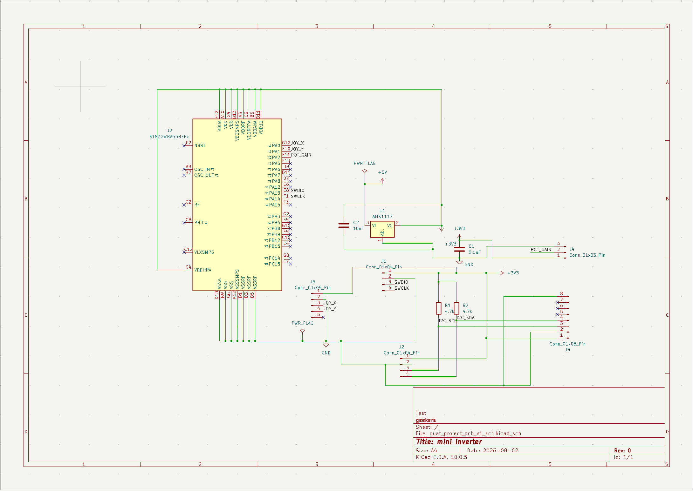

# quat_project — quaternion attitude estimation and control

A quaternion attitude estimator and PD controller for a free-floating rigid
body, running on an **ATmega2560** against a physics plant simulated as a
custom Wokwi chip — plus a custom **STM32WBA55** board to move it onto.

The plant is not a stub. `chip/chip.chip.c` integrates Euler's rigid-body
equations with **RK4** on an asymmetric inertia tensor, propagates the attitude
quaternion by **exponential map** (with a small-angle branch below θ = 1e-8 to
avoid `sin(θ)/θ` blowing up), and exposes itself over I²C at `0x42` as a fake
IMU — accelerometer and gyro registers out, torque registers in, with
high-frequency noise injected on the accelerometer. The firmware sees a sensor,
not a truth feed.

```
 chip.chip.c (plant)          sketch.ino (flight code)
 ─────────────────────        ────────────────────────────────────────────
 RK4 · Euler's equations      Mahony fusion → quaternion PD → torque out
 exponential-map quaternion   OLED artificial horizon, decoupled at 30 FPS
 noisy accel + gyro    ──I²C──▶  joystick commands attitude, pot scales gain
```

---

## The honest part

### 1. The naive-vs-optimised comparison does not show what it was built to show

The intent was to demonstrate **quaternion unwinding** — a controller that uses
the raw error quaternion without sign correction takes the long way around the
sphere. Commanding 181° and toggling `UNWINDING_DEMO` is exactly the right shape
of experiment, and the sign fix (`sign_w` in `sketch.ino`) is the correct
remedy.

But the two runs in `naive_results.csv` and `optimized_result.csv` are the same
convergence curve:

| t (ms) | naive err° | optimised err° |
|---:|---:|---:|
| 102 | 180.91 | 179.09 |
| 1000 | 55.94 | 57.12 |
| 1500 | 16.82 | 16.73 |
| 2000 | 6.51 | 6.37 |
| 2500 | 2.29 | 2.28 |
| 2736 | 1.24 | 1.24 |

First crossing of 10° / 5° / 2°: **1755 / 2148 / 2567 ms** naive versus
**1742 / 2153 / 2563 ms** optimised. Integrating ‖ω‖ over each run, the total
angular path travelled is **236.7°** naive versus **237.0°** optimised. Neither
run's error ever exceeds its starting value, so **neither controller unwound.**

Two reasons:

- **The test point is too close to the boundary.** At a 181° command the long
  way is 181° and the short way is 179°. The 2° difference is inside the noise.
  Unwinding is dramatic near **359°**, where the naive law travels almost a full
  revolution and the corrected one travels ~1°. That is the command to use.
- **The runs are different lengths.** Naive was stopped at 2.7 s, optimised ran
  to 5.7 s. The headline "2.54° → 0.00°" is therefore **run length, not
  control** — the naive run was simply never given the extra three seconds in
  which the other one finished settling.

The initial torques do differ in sign (`tx` = +17.40 naive, −17.48 optimised),
so the sign logic is live and the two controllers really do pick opposite
rotation directions. There is just nothing to see at 181°.

**Status: the experiment is designed correctly and has not yet produced a
result. Re-run both branches at a 359° command, for the same duration.**

### 2. The recorded data predates the code it appears to validate

Both CSVs were written in a single commit, `a5871e4` ("added optimized
controller"). `invSqrt` was introduced two commits later in `4b8ad59`. **Nothing
in this repository measures the cost of `invSqrt`**, and the CSVs cannot — they
were produced before it existed.

They also cannot be regenerated by the current firmware. `sketch.ino` is now a
different program: joystick-driven attitude hold with a Mahony filter and an
OLED, emitting four telemetry columns rather than the CSVs' thirteen, with the
sign correction permanently on and the `UNWINDING_DEMO` toggle gone.

### 3. `invSqrt` only wins on one of the three targets

The Quake III reciprocal square root is worth having *or* worth deleting
depending entirely on whether the part has an FPU:

| target | FPU | verdict |
|---|---|---|
| **Arduino Mega** (ATmega2560) — the Wokwi prototype | none | **wins.** `sqrtf` is a software routine and every float op is a libgcc call, so trading a root and a divide for a shift, a subtract and three multiplies is a real saving |
| **ESP32** (Xtensa LX6) | yes | **loses.** `1.0f/sqrtf(x)` is a couple of instructions and correctly rounded; the trick also pays to move between integer and float register files |
| **STM32WBA55** (Cortex-M33F) — the custom board | yes | **loses**, same reason |

So the optimisation is right for the board it was prototyped on and wrong for
the board it is headed to. `sketch.ino` now selects on `__AVR__` rather than
assuming. The AVR path also swaps `*(long*)&y` for `memcpy` — the pointer cast
is a strict-aliasing violation, undefined behaviour that `-O2` is entitled to
miscompile, and every compiler lowers the `memcpy` to the same register move.

**This is still unmeasured.** The number it needs is a `micros()` loop around
~10,000 calls of each variant on each board; until that exists the table above
is an architectural argument, not a result.

---

## The board



An STM32WBA55HEFx (Cortex-M33 + FPU, integrated radio) on 3V3 from an AMS1117
LDO, with the joystick on `PA0`/`PA1`, the gain potentiometer on `PA2`, SWD on
J1, and 4.7 kΩ I²C pull-ups to an off-board IMU on J3.

**v1 is a schematic, and it should not be fabricated as drawn.** The whole
design is 11 components. Tracing the netlist out of the `.kicad_sch` rather than
eyeballing the sheet, in severity order:

1. **`VDD11` is tied to +3V3.** Every supply pin — `VDD`, `VDDA`, `VDDANA`,
   `VDDHPA`, `VDDRF`, `VDDRFPA`, `VDDSMPS` **and `VDD11`** — sits on one net.
   `VDD11` is the 1.1 V core/radio domain, not a supply input. Driving 3.3 V
   into it is a part-killer, and it is consistent with the next item: the SMPS
   that is supposed to *produce* that rail has been no-connected instead.
2. **`VLXSMPS` is no-connect.** The internal SMPS needs its inductor between
   `VLXSMPS` and `VDD11`, or the part must be strapped for LDO mode per the
   datasheet's power-supply scheme. As drawn it is neither, which is how 1
   happened. **Fix these two together — read the datasheet's supply table and
   redraw the power section from it.**
3. **The package is `ST_WLCSP-41_2.98x2.76mm_P0.4mm_Stagger`.** A 41-ball
   wafer-level chip-scale part on 0.4 mm staggered pitch: bare die, no leads.
   That needs HDI with via-in-pad and laser microvias, a stencil and reflow, and
   it cannot be hand-soldered, reworked, or probed. It is also light-sensitive.
   The QFN version of the same silicon is routable on two layers and solderable
   with an iron. Unless there is a size constraint that justifies it, **this one
   choice is what makes the board unbuildable at hobby scale.**
4. **Decoupling is one capacitor.** `C1` (0.1 µF) and `C2` (10 µF) are the only
   caps on the sheet, both at the regulator. Eight supply pins want ~100 nF each
   placed at the ball, plus bulk. On a normal package this is the single most
   common reason a first article is dead on arrival.
5. **No crystal.** `OSC_IN`/`OSC_OUT` are no-connect, so this runs on the
   internal RC — which rules out the radio that is the reason to choose a WBA55.
   Either add the 32 MHz crystal or drop to a cheaper, non-wireless part.
6. **`NRST` floats.** It wants the usual 100 nF to ground.
7. **LDO output cap is light.** The AMS1117 wants ≥10 µF (the datasheet suggests
   22 µF tantalum) to stay stable; 0.1 µF alone is marginal.
8. **The project's root sheet is empty.** `hardware/quat_project.kicad_sch` is a
   blank A4 page, and the real design lives in
   `quat_project_pcb_v1_sch.kicad_sch`, which nothing references — so opening the
   project shows nothing. Every symbol's instance path is also still bound to
   `(project "mini inverter")`, and the title block says the same. The design was
   started by copying another project and never rebound.

**There is no layout.** `hardware/quat_project.kicad_pcb` is an empty board file
— no stackup, no footprints, no traces. Footprints *are* assigned to all 11
symbols, so the netlist would import; nothing has been placed or routed.

---

## Status

| Milestone | | State |
|---|---|---|
| M0–M1 | Quaternion math + self-test gate | ✅ |
| M2 | Rigid-body plant as a Wokwi chip (RK4, exponential map) | ✅ |
| M3 | Closed loop over I²C, perfect sensing | ✅ |
| M4 | Unwinding experiment | ⚠️ built, **does not yet reproduce the effect** — §1 |
| M5 | OLED artificial horizon, decoupled from the control loop | ✅ |
| M7 | Mahony fusion + joystick/potentiometer input | ✅ |
| M8 | `invSqrt` | ⚠️ now target-conditional, **cost still unmeasured** — §3 |
| — | Custom PCB v1 schematic | ⛔ drawn, **8 defects, do not fabricate** — see above |
| — | PCB layout | ⬜ empty board file, nothing placed |

**Next, in order:** re-run M4 at 359°; benchmark `invSqrt` on Mega and ESP32;
redraw the board's power section from the datasheet supply table and move off
the WLCSP before laying anything out.

## Running it

The Wokwi project needs `diagram.json`, `sketch.ino`, `chip/`, and the libraries
in `libraries.txt`. The board is `wokwi-arduino-mega`.

```
sketch.ino          flight code: Mahony fusion, quaternion PD, OLED, pilot input
chip/chip.chip.c    the plant — RK4 Euler's equations, I²C fake IMU at 0x42
diagram.json        Mega + custom chip + SSD1306 + joystick + potentiometer
hardware/           KiCad 10 project for the custom board (see the board section)
docs/schematic.png  rendered v1 sheet
*.csv, *.svg        M4 run data — read §1 before citing these
```
